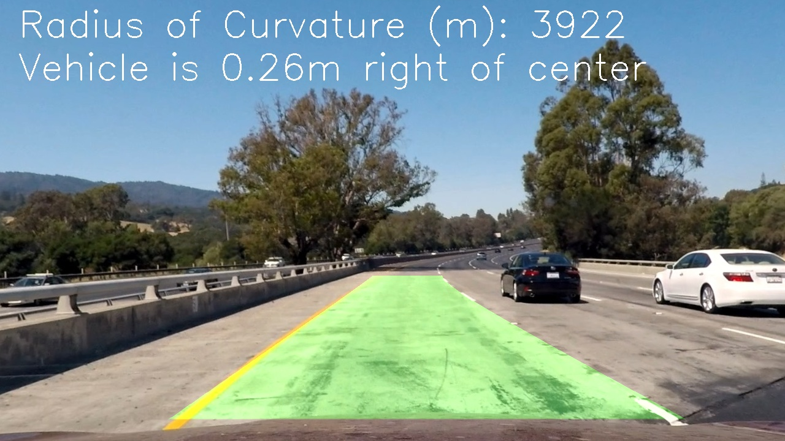

# Advanced Lane Finding
[](http://www.udacity.com/drive)


The goal of this project is to detect lane lines using only front-facing camera image data and 'classical' computer vision techniques (ie no neural networks)

### Pipeline Overview

You can find more detailed information about the lane detection pipeline in the [writeup](./writeup.md).  The general pipeline is:

    * Perform once: Find camera calibration and distortion coefficients
    * Undistort the raw camera image
    * Perform color and gradient magnitude thresholding to create a feature image
    * Use a Region of Interest (ROI) filter to remove extraneous parts of the image
    * Apply a perspective warp to transform the feature image to an overhead view
    * Detect lane lines using a sliding window approach
    * Find best-fit polynomials to represent the lane lines
    * Sense check detected lane lines and perform lane reconstruction/synthesis as needed
    * Use the discovered lane lines to calculate lane curvature and vehicle offset
    * Draw the valid lane region and warp it back to the undistorted perspective
    * Overlay the output image with the lane lines and statistics

### Prerequisites

This module has been tested on Python 3.5 and requires Numpy, OpenCV2, Matplotlib, and MoviePy.  For best results, you can clone the entire development Udacity Self-Driving environment using Anaconda ([full setup instructions](https://github.com/udacity/CarND-Term1-Starter-Kit/blob/master/doc/configure_via_anaconda.md)).  If you already have Anaconda , you can setup the environment, called ```carnd-term1```, as follows:

```
conda env create -f environment.yml
conda clean -tp
```

And activate the environment as:
```
source activate carnd-term1
```

### Use

The included ```main.py``` will process some test images (```./input/test_images```) and a sample video (```./input/project_video.mp4```) and save the results in ```./output```.  It is run as:

```
python main.py
```

At this time, you will need to modify ```main.py``` to specify your own inputs (improved functionality coming soon).  You can also use the modules and pipeline directly to fit your needs

## Authors

* Osman Shawkat
* Forked from [Udacity](https://github.com/udacity/CarND-Advanced-Lane-Lines)

## License

This project is licensed under the MIT License - see the [LICENSE.md](LICENSE.md) file for details

## Acknowledgments

* Algorithm inspiration and starter code courtesy of [Udacity's Self-Driving Car Nanodegree](https://www.udacity.com/course/self-driving-car-engineer-nanodegree--nd013) program - [Upstream](https://github.com/udacity/CarND-Advanced-Lane-Lines)
* README template courtesy of Bille Thompson - [PurpleBooth](https://github.com/PurpleBooth)